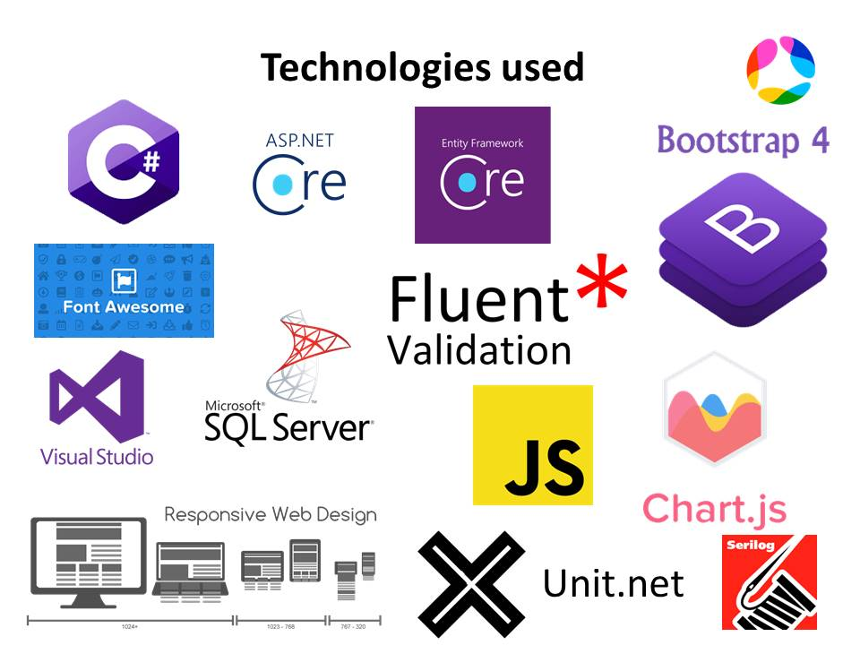

ERPSystem 
=========
Demo App for Avenga 

  

Technologies 
----------------------
  

Installation 
----------------------
Everything should work out of the box. 

Click [here](https://erpsystemdemowebapp.azurewebsites.net/) to view live demo. 

Users: 
`admin@avenga.com` 
`employee@avenga.com` 

Password: 
`aA!111` 

Built With: 
--------------------
- ASP.NET Core 5
- Entity Framework Core 5
- Razor Pages
- SQL Server
- Microsoft Identity
- xUnit.net
- Serilog
- Chart.js
- FluentValidation

Entities: 
--------------------
  

Screenshots: 
-----------
  
  
  
  
  
  
