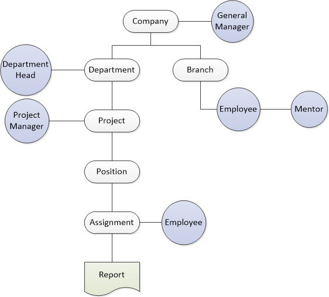
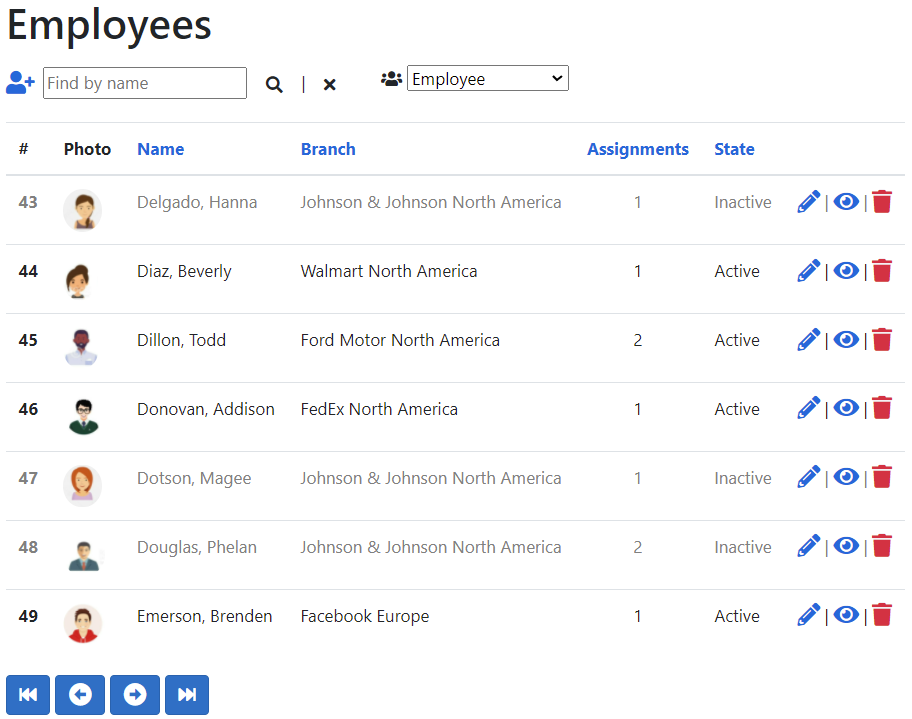

ERPSystem 
=========
Demo App for Avenga 

  

Installation 
----------------------

Click [here](https://erpsystemdemowebapp.azurewebsites.net/) to view live demo.  

Package Manager Console: 
`Update-Database` 

.NET CLI: 
`dotnet ef database update` 

Users: 
`admin@avenga.com` 
`employee@avenga.com` 

Password: 
`aA!111` 

You might need to change the `DefaultConnection` string in `appsettings.json` file. 

Built With: 
--------------------
- ASP.NET Core 5
- Entity Framework Core 5
- Razor Pages
- SQL Server
- Microsoft Identity
- xUnit.net
- Serilog

Entities: 
--------------------
  

Screenshots: 
-----------
  
  
  
  
  
  
